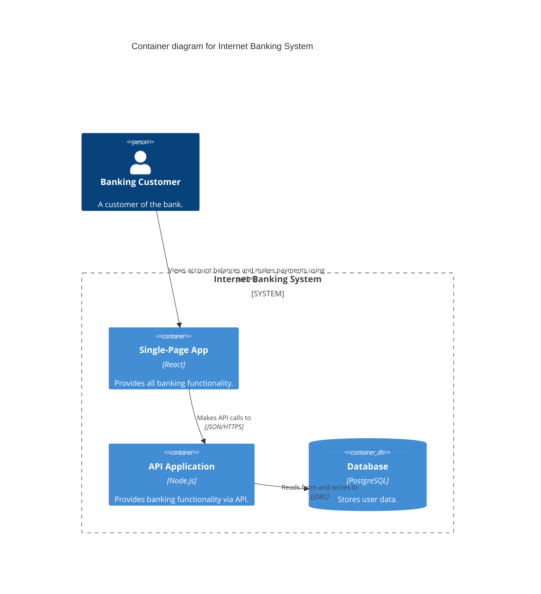

<h1 align="center">
  C4 & Architecture Skills 🏗️
</h1>

<p align="center">
  <strong>A universal "Skill" package that teaches any AI Coding Agent how to act as an expert Software Architect using the C4 model and Architecture Decision Records (ADRs).</strong>
</p>

<p align="center">
  <a href="[https://muthub-ai.github.io/c4-skills/](https://muthub-ai.github.io/c4-skills/docs/docs/skills/c4designer/)"></a>
</p>

<p align="center">
  <a href="https://github.com/muthub-ai/c4-skills/actions/workflows/test.yml"></a>
  
  
  
</p>

---

## 💡 What is this? (And why should I care?)

AI Coding agents are exceptionally good at writing code, but they often struggle to design and document software architectures consistently. This repository provides universal, agent-agnostic "Skills" (sets of strict rules, workflows, and checklists) that teach your AI assistant how to act as an expert Software Architect. 

By using these skills, your agent will automatically generate beautiful, easy-to-read **C4 Diagrams** (the "what") directly from your codebase, and systematically document **why** certain decisions were made using standard **Architecture Decision Records (ADRs)**.

---

## 📋 Table of Contents
- [Available Skills](#-available-skills)
- [Agent Compatibility Matrix](#-agent-compatibility-matrix)
- [Supported Agents & Installation](#️-supported-agents--installation)
- [The Sandbox: Try it Safely](#-the-sandbox-try-it-safely)
- [Testing](#-testing)
- [Contributing](#-contributing)

---

## 🎨 Visual Preview

Here's an example of the kind of Mermaid C4 diagrams your agent will generate directly in your IDE:



---

## 🤖 Agent Compatibility Matrix

The `SKILL.md` format is highly portable. Here is how major agents support it:

| Feature | GitHub Copilot | Claude Code | Cursor | Devin | Windsurf |
|---------|----------------|-------------|--------|-------|----------|
| **Auto-discovers SKILL.md** | ✅ | ✅ | ⚠️ via `.cursorrules` | ✅ | ⚠️ via `AGENTS.md` |
| **Reads linked .md files** | ✅ | ✅ | ✅ | ✅ | ✅ |
| **Generates Mermaid C4** | ✅ | ✅ | ✅ | ✅ | ✅ |
| **Writes to Filesystem** | ✅ | ✅ | ✅ | ✅ | ✅ |

---

## ✨ Available Skills

This repository contains two complementary skills. You can install one or both depending on your needs.

### 1. `c4designer` (The "What")
The agent becomes a C4 model expert, using Mermaid syntax to generate interactive diagrams.
- 🎨 **Design Mode:** Greenfield architecture.
- 🔍 **Document-Code Mode:** Scans your codebase to retro-document it.
- 📝 **Document-Prose Mode:** Turns specs/READMES into C4.
- 🧐 **Review Mode:** Critiques existing diagrams.
- 🔄 **Update Mode:** Updates an existing diagram with new elements.

> **Example Prompt:** *"Act as the C4 Designer. I have an existing codebase located in `src/api`. Please retro-document this system and generate a Level 2 Container Diagram."*

### 2. `adr-scribe` (The "Why")
While C4 documents *what* the system is, ADRs document *why* it was built that way. This skill enforces the standard Michael Nygard MADR template.
- 🎤 **Interview Mode:** The agent interviews you to draft a new decision record.
- 🔍 **Retro-Document Mode:** The agent infers the decision and consequences from a Pull Request or code.
- 🧐 **Review Mode:** Critiques an existing ADR for completeness.

> **Example Prompt:** *"Act as the adr-scribe. We just decided to switch from MongoDB to PostgreSQL for our new API. Please interview me to draft a new Architecture Decision Record."*

---

## ⚙️ Supported Agents & Installation

Major AI agents support dropping a `SKILL.md` into a specific directory inside your project. 

To install, **copy the desired folder (`c4designer` or `adr-scribe`)** from this repository into the correct location for your agent.

### 1. GitHub Copilot (Workspace / Chat)
GitHub Copilot discovers custom skills via the `.github/skills/` directory.

```bash
cp -r c4designer .github/skills/c4designer
cp -r adr-scribe .github/skills/adr-scribe
```

### 2. Devin
Devin natively supports the emerging `.agents/skills` standard.

```bash
cp -r c4designer .agents/skills/c4designer
cp -r adr-scribe .agents/skills/adr-scribe
```

### 3. Antigravity / Cursor / Windsurf
These agents discover context via `.cursorrules`, `AGENTS.md`, or the emerging `.agents/skills` standard.

```bash
cp -r c4designer .agents/skills/c4designer
cp -r adr-scribe .agents/skills/adr-scribe
```

### 4. Claude Code
Claude Code originally popularized the `SKILL.md` concept.

```bash
cp -r c4designer .claude/skills/c4designer
cp -r adr-scribe .claude/skills/adr-scribe
```

---

## 🛝 The Sandbox: Try it Safely

Want to test how well your AI agent performs without exposing your proprietary code? We've included a mock Internet Banking System just for this!

1. Open your terminal and start your AI Agent.
2. Tell it to look at the `tests/example-codebase` directory.
3. Open `tests/TEST_PROMPTS.md` and copy-paste one of the standardized prompts to your agent.
4. Watch it generate a beautiful architecture diagram based on the mock React/Node.js app!

> **Want to see what it should look like?** We've included the "golden" AI-generated outputs in the `tests/example-codebase/diagrams/` folder. 

---

## 🧪 Testing

To verify the integrity of the skill files and test the validity of the generated outputs, we provide a robust test suite that runs automatically via [GitHub Actions CI](https://github.com/muthub-ai/c4-skills/actions) on every Push and Pull Request.

You can run the suite locally:

```bash
cd tests
./test-skill-format.sh
```

The test runner executes three distinct suites:
1. **Structural Validation:** Dynamically scans all `SKILL.md` files to enforce YAML frontmatter standards (`version`, `requires`, `compatible_agents`).
2. **Sandbox Golden Validation:** Strictly validates the golden Mermaid C4 diagrams in the `example-codebase` against C4 syntax rules.
3. **Behavioral Fixtures:** Runs scenario-based prompt/expected-output fixtures against domain-specific linters (`validate-c4-diagram.sh` and `validate-adr.sh`) to ensure expected AI outputs are syntactically perfect.

---

## 🤝 Contributing

Contributions are always welcome! If you find a bug in the documentation or want to add support for a new AI Agent's skill discovery path, please open an issue or submit a Pull Request.

## ⚖️ License
Distributed under the MIT License.
