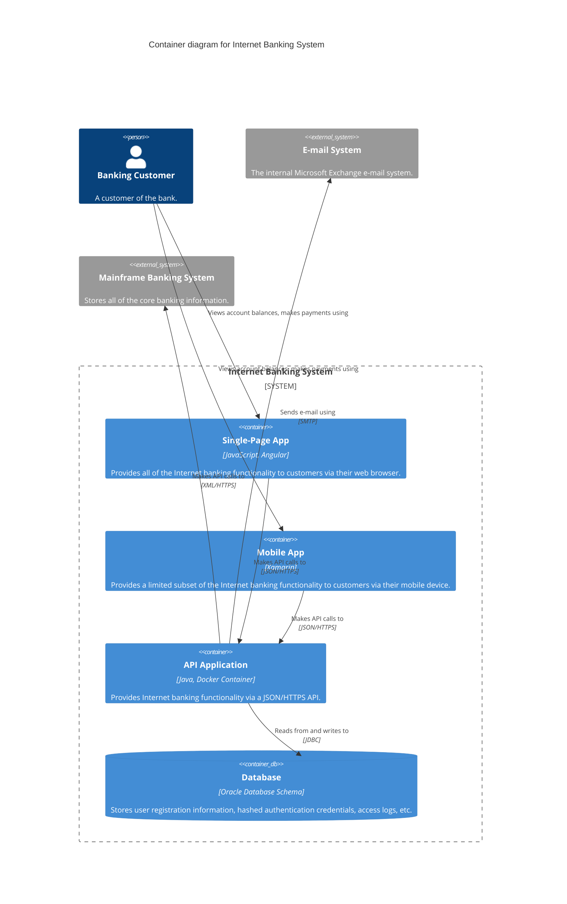
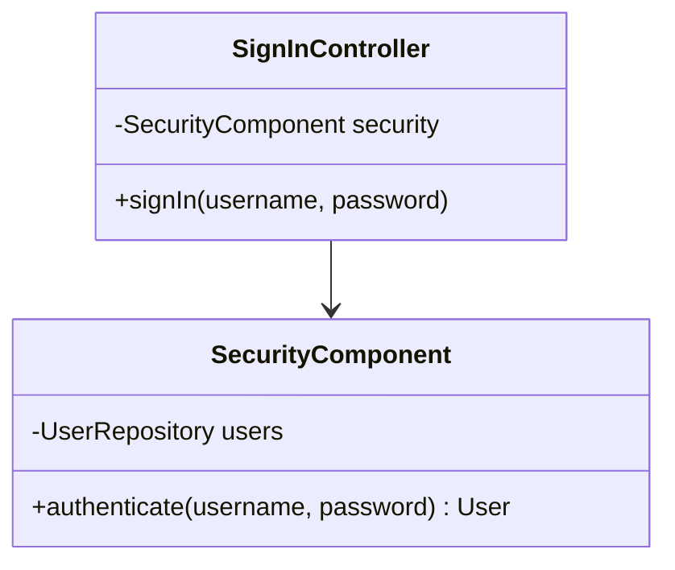

# C4 model — diagramming a software architecture

Simon Brown's C4 model ([`c4model.com`](https://c4model.com)) describes a software architecture through four hierarchical levels of abstraction. This skill covers the full cycle around a C4 diagram: design, retro-documentation, review, update.

## The 4 levels

| Level | Diagram | Mermaid | Zoom | Audience |
|---|---|---|---|---|
| 1 | **Context** | `C4Context` | System + actors / external systems | Everyone (technical and non-technical) |
| 2 | **Container** | `C4Container` | Applications, services, internal data stores | Technical team (dev, ops, architecture) |
| 3 | **Component** | `C4Component` | Internal components of a container | Developers of that container |
| 4 | **Code** | `classDiagram` (UML) | Classes/functions of a component | Developers (often generated by the IDE) |

**Simon Brown's golden rule**: *"Context + Container diagrams are sufficient for most software development teams."* Only generate levels 3 and 4 when the user explicitly asks for them or when they bring genuine value (complex container, onboarding, high-risk zone). When in doubt, produce levels 1 and 2 and propose to go deeper.

C4 also supports **supporting diagrams**: System Landscape, Deployment, Dynamic. See [`supporting-diagrams.md`](supporting-diagrams.md).

## Mode detection (router)

**Always start by identifying the mode.** If it's not obvious from the user's message, ask one question:

> "Do you want to: (a) **design** a new architecture, (b) **retro-document** an existing system (code or prose), (c) **review or explain** an existing diagram, or (d) **update** a C4 that's already in place?"

### Signals to infer without asking

| User signal | Mode |
|---|---|
| Path to a repo, code snippet pasted, *"here's my codebase"* | Document-code |
| README, ADR, spec, meeting transcript pasted | Document-prose |
| Diagram (Mermaid/PlantUML/Structurizr) pasted + *"what is this?"* / *"is this good?"* | Review |
| Existing diagram + *"add/remove/change X"* | Update |
| Vague idea, no artifact, *"I want to design…"* | Design |

### File to load based on the mode

Once the mode is known, read the corresponding file to apply its detailed flow:

| Mode | File |
|---|---|
| Design | [`mode-design.md`](mode-design.md) |
| Document-code | [`mode-document-code.md`](mode-document-code.md) |
| Document-prose | [`mode-document-prose.md`](mode-document-prose.md) |
| Review | [`mode-review.md`](mode-review.md) |
| Update | [`mode-update.md`](mode-update.md) |
| Supporting (Landscape/Deployment/Dynamic) | [`supporting-diagrams.md`](supporting-diagrams.md) |

The rules in the *Common contract* section below apply to **every** mode that produces or modifies a diagram.

## Common contract (all modes)

### Output format

Default: **one Markdown document per level**, with the diagram embedded as **Mermaid C4**. Mermaid C4 renders in most Markdown viewers that support Mermaid — GitHub and GitLab render it natively; Obsidian supports it natively; Notion supports Mermaid with varying compatibility for C4-specific syntax; VS Code requires the *Markdown Preview Mermaid Support* extension. **Always verify C4 rendering in the target viewer**, since Mermaid marks C4 syntax as experimental.

Alternatives negotiated with the user:

- **Structurizr DSL** — Simon Brown's official tool; relevant when the user wants to generate multiple views from a single source
- **PlantUML** with the C4-PlantUML library — when the project already runs on PlantUML (syntax is near-identical to Mermaid C4)
- **Image export** (SVG/PNG) — to embed in a slide deck or PDF; note that the export goes through `mermaid-cli` on the user's side
- **Markdown only without a diagram** — when the target tool supports no rendering at all

Confirm the format during framing. Never assume.

### Destination

Default: **local filesystem**, in `docs/architecture/` (or another path if the user prefers). Alternatives when an MCP is connected in the session:

- Notion page
- Linear document
- Google Drive file
- Others (Confluence, gist…) — only when the matching tool/integration is actually present

List only the external tool integrations **actually available in the session**, never invent. If several are available, ask which one. **Inline output** (rendered in the conversation without persistence) is also valid for a quick review or exploration.

### Notation rules (non-negotiable)

Rules derived from the C4 model. They apply to every diagram produced or corrected by the skill:

**Diagram**
- Explicit title (e.g. *"Container diagram for Internet Banking System"*)
- A legend in the Markdown document (*"Legend"* section), since Mermaid C4 does not always render a key by default
- Acronyms/abbreviations explained

**Elements**
- Type is always explicit (Person, System, Container, Component, DB, Queue, Ext…)
- Each element has a short description of its responsibility
- Every Container and Component states its **technology** explicitly (e.g. *"Java, Spring Boot"*, *"PostgreSQL 15"*, *"RabbitMQ"*)

**Relationships**
- Every arrow is **unidirectional** (avoid `BiRel`, split it into two `Rel`s)
- Every arrow is labeled with a concrete **intent** — **ban** bare *"Uses"*, *"Calls"*, *"Reads"*. Prefer *"Reads account balances from"*, *"Publishes OrderCreated events to"*, *"Sends email notifications via"*
- Inter-container relationships (typically IPC) state the **protocol/technology** (HTTPS/JSON, gRPC, AMQP, JDBC, SMTP…)

### Deliverable per level

**Invariant**: never deliver a bare diagram without the document that accompanies it — the diagram must remain self-standing, but the document describes the *why* (context, trade-offs, assumptions). This rule holds regardless of the output format.

Default structure (local filesystem):

```text
docs/architecture/
├── 01-context.md                            # Level 1 — always
├── 02-container.md                          # Level 2 — always
├── 03-component-<container-name>.md         # Level 3 — one per zoomed container
└── 04-code-<component-name>.md              # Level 4 — rare, on demand
```

On an MCP destination, granularity stays identical: one page/document per level, linked via the *"Links to other levels"* section of the template.

Each document follows [`level-template.md`](level-template.md):
- Overview
- Diagram
- Legend
- Elements (table: name, type, technology, responsibility)
- Key relationships (table: from, to, intent, protocol)
- Notable architectural decisions
- Assumptions
- Links to other levels

For filled-out examples, see [`examples/`](examples/).

### Pre-delivery checklist

Before any delivery, run through [`review-checklist.md`](review-checklist.md) — Simon Brown's official checklist plus the C4-specific additions introduced by this skill.

### Dialogue rules (all interactive modes)

- **Max 5 questions per batch.** Never drown the user in a form.
- **Reformulate before assuming**: *"If I understand correctly, X. Is that right?"*
- **Offer options when the user hesitates**: *"Two approaches: (A) modular monolith, (B) two services. For your context [reasons], I'd lean toward B. What do you think?"* Name trade-offs explicitly.
- **Incremental drafts**: show a partial diagram as soon as there's enough material — validate as you go rather than at the end.
- **Explicit assumptions**: anything that was guessed goes into the *"Assumptions"* section of the document, never silently baked into the diagram.
- **No premature delivery**: no final write to the chosen destination until the user has explicitly validated the current level.
- **Universal stop criterion**: the user explicitly says *"ok, that's good"*, *"finalized"*, *"we can ship"* — or an unambiguous equivalent. When in doubt, propose one more review pass rather than delivering.

## Mermaid C4 syntax — essential cheatsheet

Mermaid natively supports `C4Context`, `C4Container`, `C4Component`, `C4Dynamic`, `C4Deployment`. Level Code uses `classDiagram` (classical UML).

> **Complete, authoritative reference**: [`mermaid-c4-syntax.md`](mermaid-c4-syntax.md) (exhaustive signatures, nested boundaries, styles, directions, Context/Dynamic/Deployment examples, unsupported features).

### Essential elements

```text
# Actors and systems
Person(alias, "Label", "Description")
Person_Ext(alias, "Label", "Description")
System(alias, "Label", "Description")
System_Ext(alias, "Label", "Description")
SystemDb(alias, "Label", "Description")
SystemQueue(alias, "Label", "Description")

# Containers (level 2)
Container(alias, "Label", "Technology", "Description")
ContainerDb(alias, "Label", "Technology", "Description")
ContainerQueue(alias, "Label", "Technology", "Description")

# Components (level 3)
Component(alias, "Label", "Technology", "Description")

# Boundaries
Enterprise_Boundary(alias, "Enterprise") { ... }   # at the Context level
System_Boundary(alias, "System") { ... }           # at the Container level
Container_Boundary(alias, "Container") { ... }     # at the Component level

# Relationships
Rel(from, to, "Intent label", "Technology/Protocol")
Rel_U / Rel_D / Rel_L / Rel_R                      # direction hints
```

### Reference example — Container diagram



### Level 4 — Code (UML)

Mermaid has no native `C4Code` type. Use `classDiagram` — consistent with C4 practice.



## Common pitfalls to avoid

- **Skipping mode detection** — producing a diagram without knowing whether the user wants to design, retro-document, review, or update. The right workflow depends entirely on the mode.
- **Mixing abstraction levels** in the same diagram (e.g. a Container next to a Component at level 2)
- **Forgetting external systems** at the Context level (a system never lives alone)
- **Overly dense diagrams** — if a Container has more than 15-20 components, it probably needs to be split
- **Useless arrow labels** (*"Uses"*, *"Calls"*) — always spell out the intent
- **Container / Component confusion** — a Container is a *runtime/process deployable independently*; a Component is a grouping *inside* a container
- **Forgetting technology** on Containers/Components — strict C4 rule
- **Delivering without validation** — no final write until the user has said *"ok"*
- **Inventing to fill gaps** instead of listing assumptions — any unconfirmed inference belongs in the *Assumptions* section

## Bundled references

Documentation for the selected mode (load with `Read` after detection):

- [`mode-design.md`](mode-design.md) — greenfield design, 5 dialogued phases
- [`mode-document-code.md`](mode-document-code.md) — retro-doc from a repo (with delegation to sub-agents or deep scanning if needed)
- [`mode-document-prose.md`](mode-document-prose.md) — retro-doc from README/ADR/spec
- [`mode-review.md`](mode-review.md) — critique or explanation of a diagram
- [`mode-update.md`](mode-update.md) — evolving an existing C4
- [`supporting-diagrams.md`](supporting-diagrams.md) — System Landscape, C4Deployment, C4Dynamic

Cross-cutting references (consult as needed):

- [`mermaid-c4-syntax.md`](mermaid-c4-syntax.md) — complete Mermaid C4 syntax (sourced from the official docs [`mermaid.js.org/syntax/c4.html`](https://mermaid.js.org/syntax/c4.html))
- [`review-checklist.md`](review-checklist.md) — Simon Brown's review checklist ([`c4model.com/diagrams/checklist`](https://c4model.com/diagrams/checklist))
- [`level-template.md`](level-template.md) — Markdown template to use for each level
- [`examples/`](examples/) — filled-out example deliverables (Internet Banking System)
