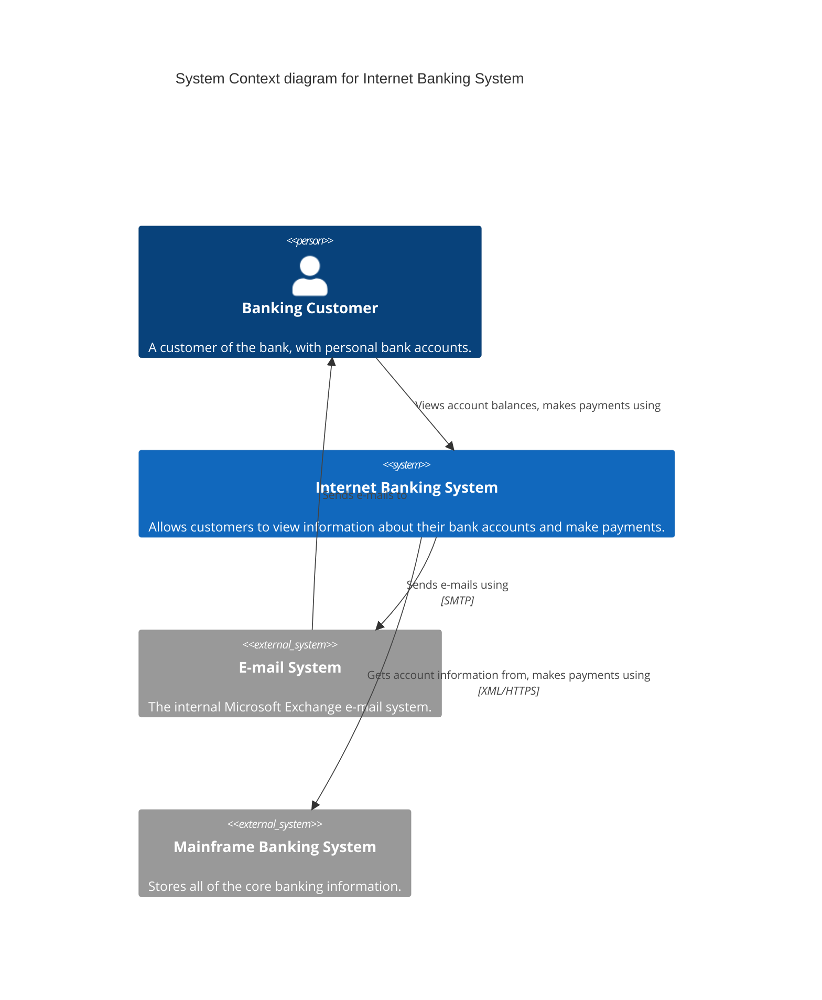

# Level 1 — System Context — Internet Banking System

> **Diagram type**: System Context
> **Scope**: The Internet Banking System as seen from the outside — who uses it and which external systems it depends on.
> **Audience**: Everyone (technical and non-technical); suitable for business stakeholders, product managers, and engineers joining the project.

## Overview

The Internet Banking System lets customers of "Big Bank plc" view their account balances, consult recent transactions, and initiate payments. It is a customer-facing layer that does **not** own the core banking data itself — account balances and payment authorization live in the Mainframe Banking System, which the Internet Banking System calls as a system of record.

This diagram answers the question *"what is the Internet Banking System, and what does it interact with?"* before any decomposition into containers or components. It is Simon Brown's canonical example and used here as a reference for the skill's output format.

## Diagram

## Legend

- **Person / actor**: human user of the system
- **System (in scope)**: the Internet Banking System — the subject of this diagram
- **External system**: out-of-scope system our system interacts with (Mainframe, E-mail)
- No custom colors, shapes, or border styles used — Mermaid C4 default rendering

## Elements

| Element | Type | Technology | Responsibility |
|---|---|---|---|
| Banking Customer | Person | — | End user with personal bank accounts. Primary actor driving all flows in this system. |
| Internet Banking System | System (in scope) | — *(detailed at Container level)* | Lets customers view accounts and make payments. Delegates all actual banking operations to the Mainframe. |
| Mainframe Banking System | System_Ext | — | Owns all core banking data (balances, transactions, payment authorization). System of record. |
| E-mail System | System_Ext | Microsoft Exchange | Sends transactional emails to customers (password resets, transfer confirmations, alerts). |

## Key relationships

| From | To | Intent | Protocol / Technology |
|---|---|---|---|
| Banking Customer | Internet Banking System | Views account balances, makes payments using | HTTPS (implicit at Context level) |
| Internet Banking System | Mainframe Banking System | Gets account information from, makes payments using | XML/HTTPS |
| Internet Banking System | E-mail System | Sends e-mails using | SMTP |
| E-mail System | Banking Customer | Sends e-mails to | (off-path — separate arrow, since e-mail is asynchronous) |

## Notable architectural decisions

- **Mainframe as system of record, not system of engagement** — the Internet Banking System does not duplicate balance/transaction data. This avoids a two-way sync problem and keeps the Mainframe authoritative, at the cost of depending on its availability and latency.
- **E-mail via internal Exchange rather than a SaaS** (e.g. SendGrid) — chosen for data-residency reasons (all customer communications stay within the bank's infrastructure).
- **Unidirectional arrow between E-mail System and Customer** — customers do not reply to the Internet Banking System's emails via email; all inbound interaction goes through the web/mobile UI. Splitting this from the customer→banking arrow keeps intent explicit.

## Assumptions

None — this diagram is Simon Brown's canonical example used verbatim. Every relationship label and protocol is explicitly stated in the source material.

In a real project, this section would list any inference made from incomplete information (e.g. *"we assume the Mainframe API is XML over HTTPS — the team confirmed XML but we have not seen the schema"*).

## Links to other levels

- ↓ [Level 2 — Container diagram](./02-container.example.md) — zoom inside the Internet Banking System
- See also: [Simon Brown's original Context diagram at c4model.com](https://c4model.com/diagrams/system-context)
