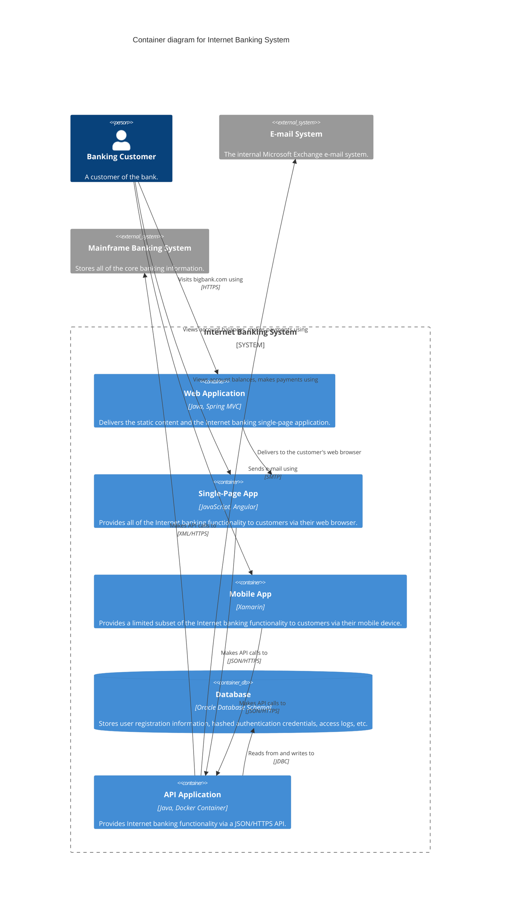

# Level 2 — Container — Internet Banking System

> **Diagram type**: Container
> **Scope**: The containers (independently deployable applications and data stores) that together implement the Internet Banking System.
> **Audience**: Technical team — developers, ops, architects, SREs. Sufficient detail to reason about deployment, scaling, and integration without diving into code.

## Overview

The Internet Banking System is composed of five containers deployed independently: a traditional server-rendered **Web Application** (Spring MVC) that serves the landing pages, a **Single-Page App** (Angular) that hosts the main banking UI in the browser, a **Mobile App** (Xamarin), a **Database** (Oracle) for credentials and access logs, and an **API Application** (Java, Dockerized) that fronts the Mainframe and handles business logic.

The SPA and Mobile App are the two UI surfaces; they both talk to the same JSON/HTTPS API. The Web App's sole job is to deliver the SPA to the browser. Authentication data (hashed credentials, access logs) lives in the Oracle database; authoritative account data lives in the Mainframe and is never cached locally.

## Diagram

## Legend

- **Person / actor**: human user of the system
- **System boundary** (rounded rectangle): the scope of the Internet Banking System
- **Container**: independently deployable application
- **Container (DB)**: independently deployable data store
- **External system**: out-of-scope system (Mainframe, E-mail) we interact with
- No custom colors or border styles — Mermaid C4 default rendering

## Elements

| Element | Type | Technology | Responsibility |
|---|---|---|---|
| Banking Customer | Person | — | End user. Interacts with the Web App, SPA, or Mobile App. |
| Web Application | Container | Java + Spring MVC | Serves the landing pages and delivers the SPA's static assets to the customer's browser. No business logic. |
| Single-Page App | Container | JavaScript + Angular | Runs in the customer's browser. Hosts the main banking UX. |
| Mobile App | Container | Xamarin | Native mobile app offering a subset of the banking functionality. |
| Database | Container (DB) | Oracle 19c (schema) | Stores user registration, hashed credentials, access logs. Does **not** store account balances. |
| API Application | Container | Java 21 + Spring Boot, packaged as a Docker container | Fronts the Mainframe and applies business logic. Entry point for SPA and Mobile. |
| E-mail System | External System | Microsoft Exchange | Receives SMTP requests from the API to send transactional emails. |
| Mainframe Banking System | External System | — | System of record for account data. Consulted for every balance read and payment. |

## Key relationships

| From | To | Intent | Protocol / Technology |
|---|---|---|---|
| Customer | Web Application | Visits bigbank.com using | HTTPS |
| Customer | Single-Page App | Views account balances, makes payments using | *(runs in-browser; no network edge)* |
| Customer | Mobile App | Views account balances, makes payments using | *(installed natively on the device)* |
| Web Application | Single-Page App | Delivers to the customer's web browser | *(static asset response)* |
| Single-Page App | API Application | Makes API calls to | JSON/HTTPS |
| Mobile App | API Application | Makes API calls to | JSON/HTTPS |
| API Application | Database | Reads from and writes to | JDBC |
| API Application | E-mail System | Sends e-mail using | SMTP |
| API Application | Mainframe Banking System | Makes API calls to | XML/HTTPS |

## Notable architectural decisions

- **SPA + Web App split** (rather than a single full-stack app): the Web Application is a thin server whose only job is to deliver the SPA. Keeping the two separate allows deploying the SPA independently (e.g. to a CDN) and simplifies the server-side role. Trade-off: two deployables to operate instead of one.
- **SPA and Mobile both call the same API directly** (not through the Web Application): avoids adding a hop, keeps the Web App's responsibility narrow, and lets the Mobile App use the same backend contract as the SPA. Trade-off: the API is now a public surface that must enforce auth itself.
- **No local cache of account data**: the Mainframe is the single source of truth for balances and transactions. Eliminates synchronization complexity at the cost of runtime dependency on the Mainframe's availability. Latency is mitigated by request-scoped caching inside the API Application, not at the container level.
- **Oracle DB dedicated to auth and audit data only**: keeping customer banking data out of this schema means a breach of the Internet Banking System does not expose core banking data — that stays in the Mainframe, a more hardened perimeter.

## Assumptions

None — this diagram is Simon Brown's canonical example used verbatim. Every technology and protocol is explicit in the source material.

In a real retro-documentation session, this section would list things like:
- *"Assumption: the API's request-scoped caching is Redis-based — observed a `spring-data-redis` dependency but no explicit confirmation from the team."*
- *"Assumption: the SPA is served from the same origin as the Web App — not confirmed, inferred from the single `bigbank.com` domain."*

## Links to other levels

- ↑ [Level 1 — System Context](./01-context.example.md) — zoom out to actors and external systems
- ↓ *Level 3 — Component diagrams (not included in this example set — would zoom into the API Application, the SPA, or the Mobile App individually)*
- See also: [Simon Brown's original Container diagram at c4model.com](https://c4model.com/diagrams/container)
