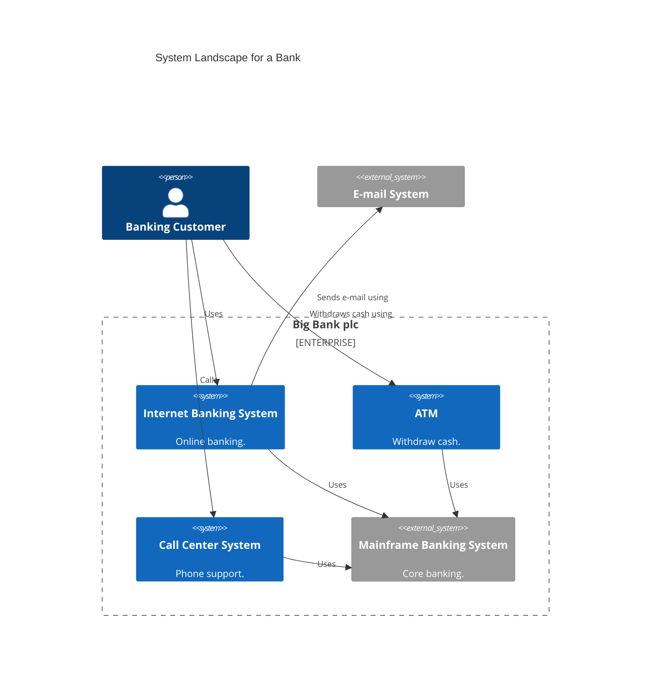
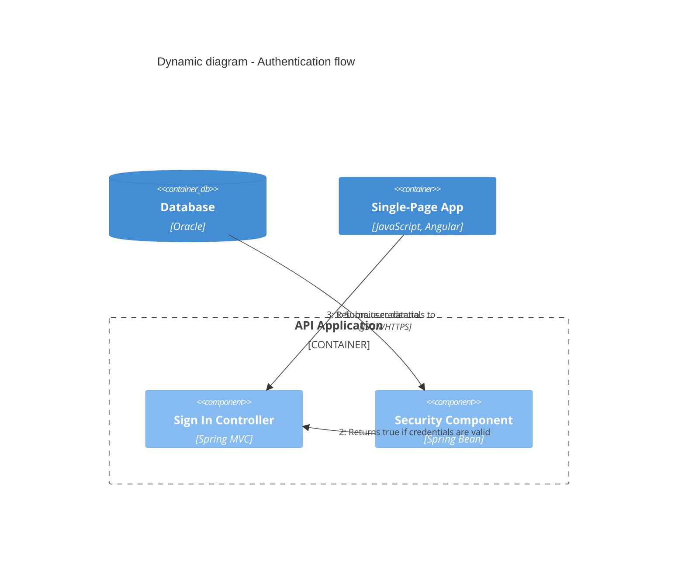
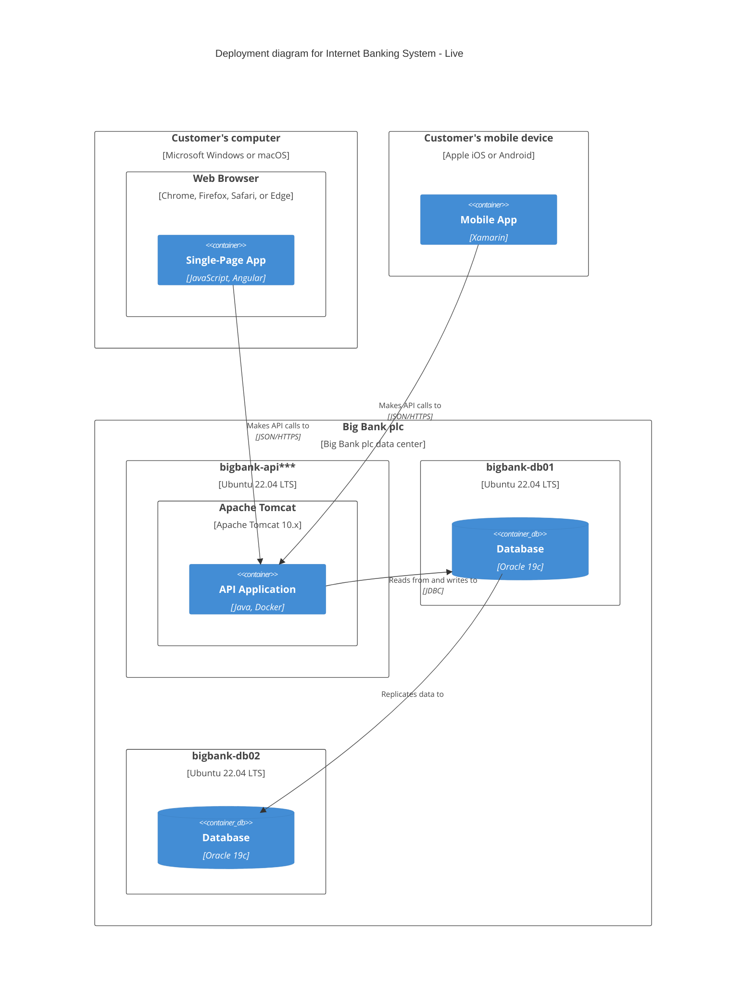

# Mermaid C4 — syntax reference

Syntax reference for C4 in Mermaid. Normative content sourced from the official Mermaid documentation ([`mermaid.js.org/syntax/c4.html`](https://mermaid.js.org/syntax/c4.html)); editorial advice is clearly labeled.

> **Status**: the official Mermaid docs state that the C4 syntax is **experimental** — *"The syntax and properties can change in future releases."* Always verify it renders correctly in the target viewer (GitHub, Mermaid Live Editor, Confluence, Notion…) before publishing.
>
> **PlantUML compatibility**: Mermaid notes that its C4 syntax is compatible with the C4-PlantUML library. Diagrams written in one are close to those written in the other.

## The 5 C4 diagram types in Mermaid

| Keyword | C4 level | Usage |
|---|---|---|
| `C4Context` | 1 | System + actors + external systems |
| `C4Container` | 2 | Containers (apps + stores) of the system |
| `C4Component` | 3 | Components of a container |
| `C4Dynamic` | — | Numbered flow between elements (supporting diagram) |
| `C4Deployment` | — | Deployment topology (nodes + deployed containers) |

For level 4 (Code), Mermaid has no `C4Code` type. Use `classDiagram` (classical UML) — consistent with official C4 practice.

## Elements — full signatures

Parameters prefixed with `?` are optional. The `$link` parameter is always optional.

### Persons

```text
Person(alias, label, ?descr, ?sprite, ?tags, $link)
Person_Ext(alias, label, ?descr, ?sprite, ?tags, $link)
```

### Systems (Context level)

```text
System(alias, label, ?descr, ?sprite, ?tags, $link)
System_Ext(alias, label, ?descr, ?sprite, ?tags, $link)
SystemDb(alias, label, ?descr, ?sprite, ?tags, $link)
SystemDb_Ext(alias, label, ?descr, ?sprite, ?tags, $link)
SystemQueue(alias, label, ?descr, ?sprite, ?tags, $link)
SystemQueue_Ext(alias, label, ?descr, ?sprite, ?tags, $link)
```

### Containers (Container level)

```text
Container(alias, label, ?techn, ?descr, ?sprite, ?tags, $link)
Container_Ext(alias, label, ?techn, ?descr, ?sprite, ?tags, $link)
ContainerDb(alias, label, ?techn, ?descr, ?sprite, ?tags, $link)
ContainerDb_Ext(alias, label, ?techn, ?descr, ?sprite, ?tags, $link)
ContainerQueue(alias, label, ?techn, ?descr, ?sprite, ?tags, $link)
ContainerQueue_Ext(alias, label, ?techn, ?descr, ?sprite, ?tags, $link)
```

### Components (Component level)

```text
Component(alias, label, ?techn, ?descr, ?sprite, ?tags, $link)
Component_Ext(alias, label, ?techn, ?descr, ?sprite, ?tags, $link)
ComponentDb(alias, label, ?techn, ?descr, ?sprite, ?tags, $link)
ComponentDb_Ext(alias, label, ?techn, ?descr, ?sprite, ?tags, $link)
ComponentQueue(alias, label, ?techn, ?descr, ?sprite, ?tags, $link)
ComponentQueue_Ext(alias, label, ?techn, ?descr, ?sprite, ?tags, $link)
```

### Deployment (Deployment level)

```text
Deployment_Node(alias, label, ?type, ?descr, ?sprite, ?tags, $link)
Node(alias, label, ?type, ?descr, ?sprite, ?tags, $link)           # shortcut
Node_L(alias, label, ?type, ?descr, ?sprite, ?tags, $link)          # left-aligned
Node_R(alias, label, ?type, ?descr, ?sprite, ?tags, $link)          # right-aligned
```

## Boundaries — grouping elements

```text
Boundary(alias, label, ?type, ?tags, $link)
Enterprise_Boundary(alias, label, ?tags, $link)
System_Boundary(alias, label, ?tags, $link)
Container_Boundary(alias, label, ?tags, $link)
```

**Editorial advice** — pick the boundary by level:
- `Enterprise_Boundary` → Context level, wrapping an organization's systems
- `System_Boundary` → Container level, wrapping the containers of a system
- `Container_Boundary` → Component level, wrapping the components of a container

Boundaries can be nested. Syntax: `{` `}` after the label.

## Relationships — full syntax

### Relationship types

| Type | Syntax | Usage |
|---|---|---|
| `Rel` | `Rel(from, to, label, ?techn, ?descr, ?sprite, ?tags, $link)` | Directed relationship |
| `BiRel` | `BiRel(from, to, label, ?techn, ?descr, ?sprite, ?tags, $link)` | Bidirectional relationship |
| `RelIndex` | `RelIndex(index, from, to, label, ?tags, $link)` | For `C4Dynamic` — the index is ignored; order comes from position in the code |

**Editorial advice** — avoid `BiRel`: split it into two distinct `Rel` calls to make each intent explicit.

### Directional variants

Short and long forms are equivalent:

```text
Rel_U / Rel_Up         # upward
Rel_D / Rel_Down       # downward
Rel_L / Rel_Left       # leftward
Rel_R / Rel_Right      # rightward
Rel_Back               # reversed arrow
```

Directional variants help guide layout — see the "Layout" section below.

## Styling and customization

### `UpdateElementStyle`

Updates an element's appearance without creating a legend entry.

```text
UpdateElementStyle(alias, ?bgColor, ?fontColor, ?borderColor, ?shadowing, ?shape, ?sprite, ?techn, ?legendText, ?legendSprite)
```

### `UpdateRelStyle`

Updates a relationship's appearance and the position of its label.

```text
UpdateRelStyle(from, to, ?textColor, ?lineColor, ?offsetX, ?offsetY)
```

`offsetX` and `offsetY` shift the label from its default position (in pixels).

### `UpdateLayoutConfig`

Adjusts layout dimensions.

```text
UpdateLayoutConfig(?c4ShapeInRow, ?c4BoundaryInRow)
```

Default values: `c4ShapeInRow=4`, `c4BoundaryInRow=2`.

## Parameter passing — positional vs named

Two equivalent syntaxes for optional parameters. Prefix with `$` for named.

**Positional**:

```text
UpdateRelStyle(customerA, bankA, "red", "blue", "-40", "60")
```

**Named** (free order, allows skipping intermediate params):

```text
UpdateRelStyle(customerA, bankA, $offsetX="-40", $offsetY="60", $lineColor="blue", $textColor="red")
UpdateRelStyle(customerA, bankA, $offsetY="60")
```

Named form is more readable when passing only a few options.

## Layout — controlling rendering

Per the Mermaid docs: *"The layout does not use a fully automated layout algorithm. The position of shapes is adjusted by changing the order in which statements are written."*

In practice:
- **Statement order** = primary layout lever
- **Direction suffixes** (`Rel_U`, `Rel_D`, `Rel_L`, `Rel_R`) = secondary lever
- **`UpdateLayoutConfig`** = control over shapes-per-row

If the rendering is unreadable, reorder elements before piling on styles.

## Features not supported (as of this reference's compilation)

Per the official Mermaid docs, the following features are **not yet supported**:

- `sprite`
- `tags` and `AddElementTag` / `AddRelTag`
- `link` parameter (`$link`)
- `Legend`
- Layout statements (`Lay_U`, `Lay_D`, `Lay_L`, `Lay_R` and variants)
- Custom shape functions (`RoundedBoxShape()`, `EightSidedShape()`)
- Line-style functions (`DashedLine()`, `DottedLine()`, `BoldLine()`)

These features exist in C4-PlantUML but not (yet) in Mermaid. Check the official docs before depending on any of them.

## Full examples

The examples below are illustrative, consistent with the syntax documented by Mermaid.

### Context — with `Enterprise_Boundary`



### Dynamic — numbered sequence

Inside a `C4Dynamic`, `Rel` calls are **automatically numbered** in declaration order.



### Deployment — nested nodes



## Common pitfalls (editorial advice)

- **Long overflowing labels** — prefer a short description (1-2 lines) in the diagram, expand in the accompanying Markdown.
- **Deeply nested boundaries** (3+ levels) — often renders poorly. Better split into multiple diagrams.
- **Special characters in labels** — escape quotes if needed, avoid backticks.
- **Relying on an unsupported feature** (see list above) — check the official docs before.

## Links

- Official Mermaid docs: [`mermaid.js.org/syntax/c4.html`](https://mermaid.js.org/syntax/c4.html)
- Simon Brown's C4 model site: [`c4model.com`](https://c4model.com)
- C4-PlantUML (compatible syntax): [`github.com/plantuml-stdlib/C4-PlantUML`](https://github.com/plantuml-stdlib/C4-PlantUML)
- ← Back to SKILL: [`SKILL.md`](SKILL.md)
