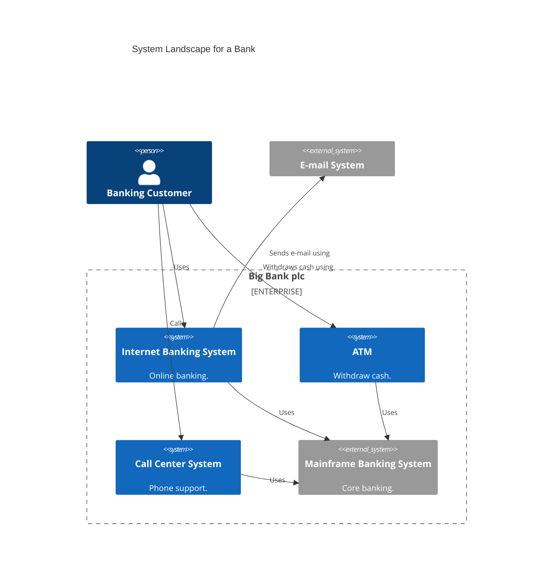

# Supporting diagrams

> Beyond the 4 canonical levels (Context / Container / Component / Code), the C4 model offers several **supporting diagrams** that enrich the main view. Simon Brown calls them *"supporting diagrams"*.

These diagrams **never replace** a Context or a Container — they add on top of them when a specific need arises.

## System Landscape — portfolio view

### When to use

- The user has **multiple systems** that interact (a product portfolio, a business ecosystem)
- Triggers: *"give me an overview of all our products"*, *"how do our systems talk to each other?"*, *"enterprise view"*

### Form

An extended Context, typically with an `Enterprise_Boundary` wrapping several internal `System`s, showing shared actors and external systems.

### Pitfalls to avoid

- Don't mix the Landscape level with the Container level — a Landscape is still a Context (you see `System`s, not `Container`s)
- Avoid more than ~7-10 systems in the same view; beyond that, split by domain

## C4Deployment — deployment topology

### When to use

- The user wants to show **where** containers run in production (nodes, cloud regions, k8s clusters, machines)
- Triggers: *"show me how it's deployed"*, *"cloud architecture"*, *"AWS topology"*

### Form

`Deployment_Node`s that can contain other `Deployment_Node`s (nesting) or `Container` / `ContainerDb`. `Rel`s between containers work as at the Container level.

See [`mermaid-c4-syntax.md`](mermaid-c4-syntax.md) section *"Deployment — nested nodes"* for the full example.

### Best practices

- One Deployment diagram **per environment** (dev, staging, prod) if topologies differ
- Specify the node's `type` (Ubuntu 22.04, EKS cluster, Fargate task, Kubernetes pod…)
- Link each `Container` in the Deployment to its counterpart at the Container level — no "ghost" containers that exist only in deployment

## C4Dynamic — sequence of interactions

### When to use

- The user wants to show a **runtime flow** for a specific use case (authentication, checkout, webhook processing…)
- Triggers: *"show me the sign-in flow"*, *"explain the checkout journey"*, *"sequence for X"*

### Form

A diagram where each `Rel` is automatically numbered by declaration order. Unlike a classical UML sequence diagram, C4Dynamic stays centered on C4 elements (Container, Component) and their interaction, not on fine-grained message exchanges.

See [`mermaid-c4-syntax.md`](mermaid-c4-syntax.md) section *"Dynamic — numbered sequence"* for the full example.

### Best practices

- One C4Dynamic **per use case** — don't stack multiple scenarios in the same diagram
- Explicit title including the use case (*"Authentication flow"*, *"Checkout happy path"*)
- For complex flows with many branches, prefer a classical UML sequence diagram

## Picking the right supporting diagram

| User need | Diagram |
|---|---|
| *"Overall view of all our systems"* | System Landscape |
| *"Where does it run in prod"* | C4Deployment |
| *"How a specific scenario unfolds"* | C4Dynamic |
| *"How it's architected"* (default) | Context + Container (not supporting — that's the main C4) |

Propose a supporting diagram **only** when the user expresses a need it covers. Don't produce one by anticipation.

## Links

- ← Back: [`SKILL.md`](SKILL.md)
- Full syntax for supporting diagrams: [`mermaid-c4-syntax.md`](mermaid-c4-syntax.md)
- Simon Brown on supporting diagrams: [`c4model.com/diagrams`](https://c4model.com/diagrams)
