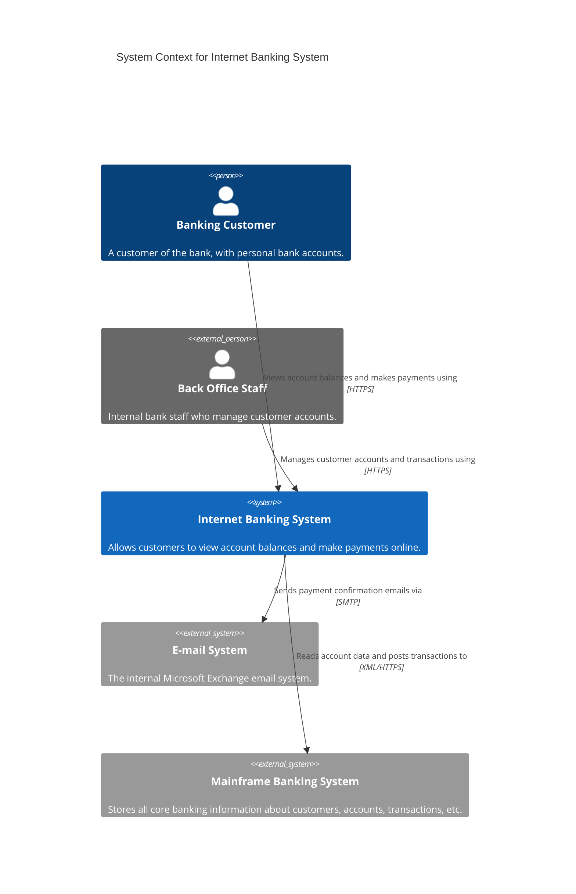
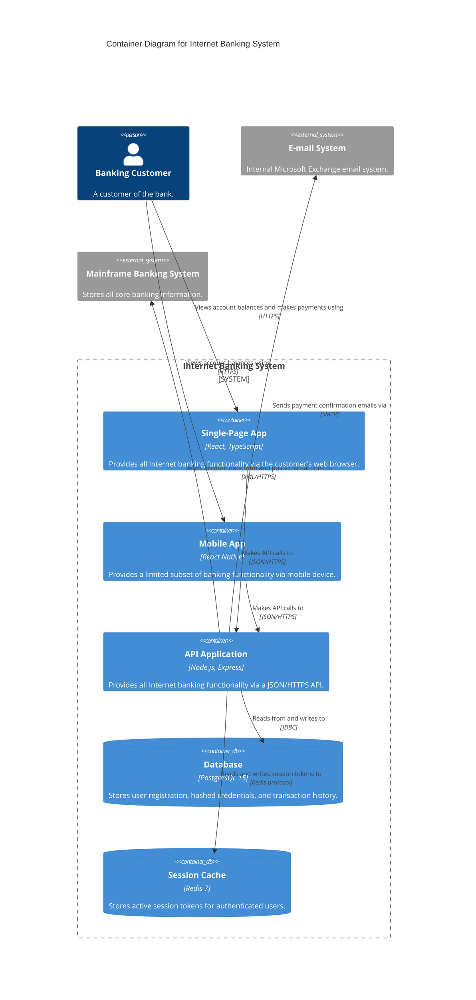

# Internet Banking System

A complete worked example showing both a Level 1 Context and Level 2 Container diagram for a fictional Internet Banking System — the canonical C4 model reference example.

## Level 1: System Context

**Prompt used:**
```
Act as the C4 Designer. Generate a Level 1 System Context diagram for
an Internet Banking System. Customers view balances and make payments.
The system connects to an internal email server and a mainframe.
```

**Output:**



### Reading this diagram

| Element | Type | Meaning |
|---------|------|---------|
| Banking Customer | `Person` | A human who interacts with the system |
| Back Office Staff | `Person_Ext` | An internal user who also interacts but is outside the system boundary |
| Internet Banking System | `System` | The system we are describing |
| E-mail System | `System_Ext` | An external dependency |
| Mainframe Banking System | `System_Ext` | Another external dependency |

---

## Level 2: Container Diagram

**Prompt used:**
```
Now go deeper. Generate a Level 2 Container Diagram for the
Internet Banking System. Include a React SPA, a Node.js API,
a PostgreSQL database, and a Redis session cache.
```

**Output:**



### Key design decisions visible in this diagram

1. **SPA and Mobile App are separate containers** — different technology stacks (`React` vs `React Native`) and can be deployed and scaled independently.
2. **Session cache is separate from the database** — Redis is used for ephemeral session data; PostgreSQL for durable records. This is visible in the diagram without reading any code.
3. **All external system connections go through the API** — the SPA never calls the mainframe directly. This is a security boundary made visible by C4.
