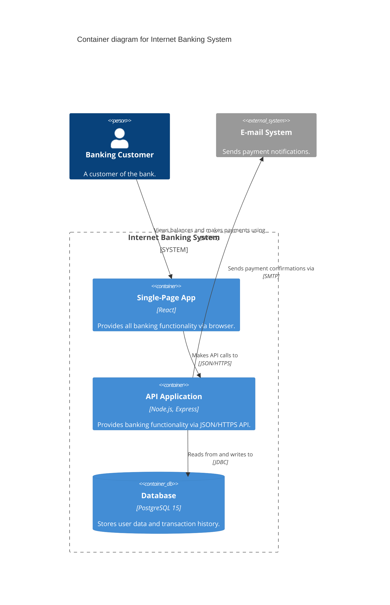

# Your First Diagram

Generate a C4 Container Diagram from scratch in under 5 minutes.

## What you'll build

A Level 2 Container Diagram for a simple banking API — showing the React frontend, Node.js API, and PostgreSQL database, with labeled relationships between them.

## Prerequisites

- `c4designer` skill installed (see [Installation](./installation))
- Your AI agent open and ready

## Step 1: Trigger the skill

Open your agent's chat panel and paste this prompt:

```
Act as the C4 Designer. I want to design a new system called "Internet Banking".
It will have a React SPA frontend, a Node.js REST API, and a PostgreSQL database.
Customers log in, view their balance, and make payments. Generate a Level 2 Container Diagram.
```

## Step 2: The agent will ask clarifying questions

The `c4designer` skill runs a structured dialogue before producing output. It will ask things like:
- *"Do external systems (email, payment gateway) connect to this system?"*
- *"What format do you want? (Mermaid/PlantUML/Structurizr)"*
- *"Where should I save the output? (local file / inline)"*

Answer these questions to get a precise diagram.

## Step 3: Expected output

After the dialogue, the agent will produce a Markdown file like this:



:::tip
Notice the key C4 rules the agent enforces:
- Every `Rel` has a **descriptive intent** (not "Uses" or "Calls")
- Every `Container` states its **technology** explicitly
- An **external system** (`email`) is included — systems never live alone
:::

## Step 4: Iterate

The agent won't write to disk until you confirm. You can refine the diagram:

```
Add a message queue between the API and the email system. Use RabbitMQ.
```

The agent will update the diagram, adding a `ContainerQueue` and splitting the relationship into two `Rel` statements.

## Next steps

- Try the **Document-Code** mode — point the agent at your real codebase
- Read the full [c4designer reference](../skills/c4designer)
- See more [examples](../examples/banking-system)
