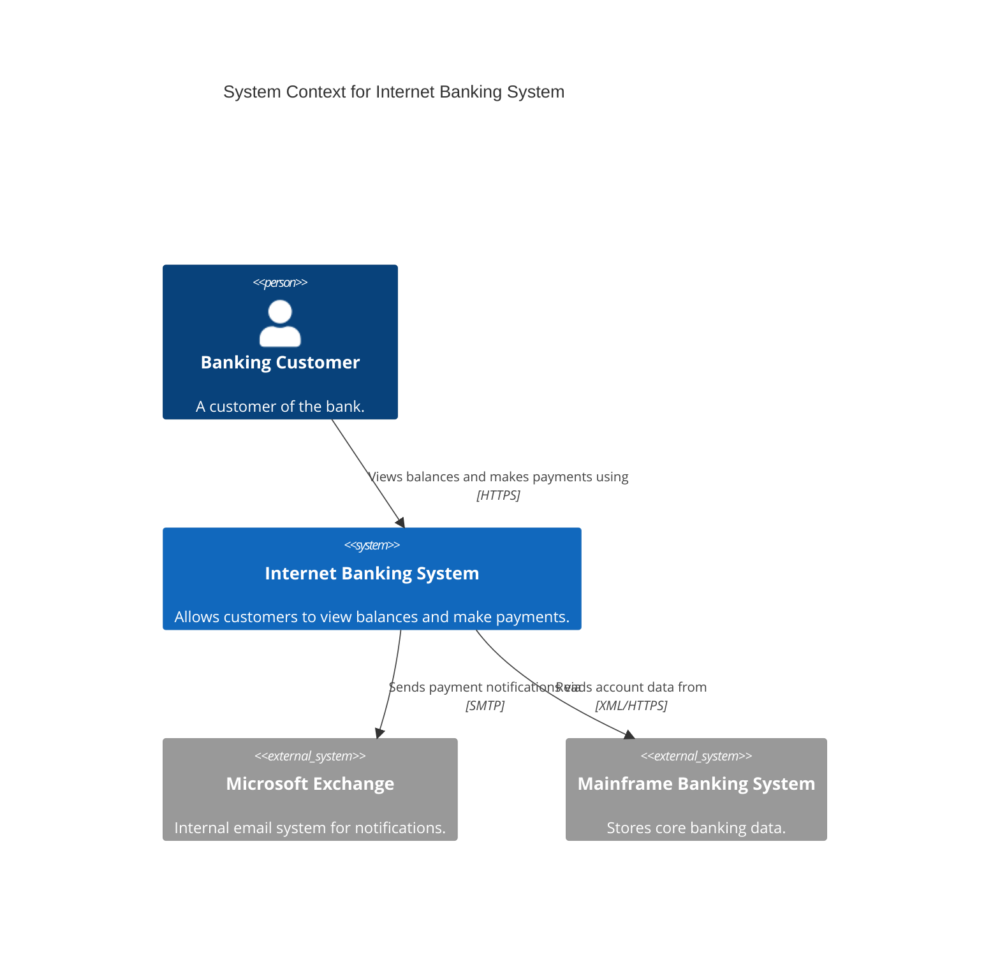

# Document-Prose Mode

Use this mode to generate C4 diagrams from **written descriptions** — README files, architecture specs, meeting transcripts, or any prose that describes your system.

## When it activates

- You paste a README, spec, or ADR
- *"Here's our design doc, turn this into a C4 diagram"*
- A meeting transcript or technical brief is provided

## Example prompt

```
Act as the C4 Designer. Please read the following README and produce
a Level 1 System Context Diagram.

---
# Internet Banking System

This system serves banking customers by allowing them to view account
balances and make payments. It integrates with an internal Microsoft
Exchange email system to send notifications. The backend connects to
our Mainframe Banking System for core account data.
```

## What it produces

From the prose above, the agent extracts:

- **System**: Internet Banking System
- **Actor**: Banking Customer (inferred)
- **External systems**: Microsoft Exchange (email), Mainframe Banking System
- **Relationships**: customer → system, system → email, system → mainframe



## Tips for better results

1. **Be explicit about external dependencies** — mention APIs, third-party services, databases by name
2. **State the user types** — *"customers"*, *"admins"*, *"internal staff"*
3. **Include data flows** — *"the API calls the payment gateway when a transaction is submitted"*
4. **Mention technology if known** — *"the backend is Java + Spring Boot"*

## Handling ambiguity

If the prose is ambiguous, the agent will list its assumptions:

```
## Assumptions
- Treated "users" as a single Person actor (Banking Customer).
  If there are multiple user types (admin, customer), please clarify.
- Assumed HTTPS for all external integrations since no protocol was specified.
```
