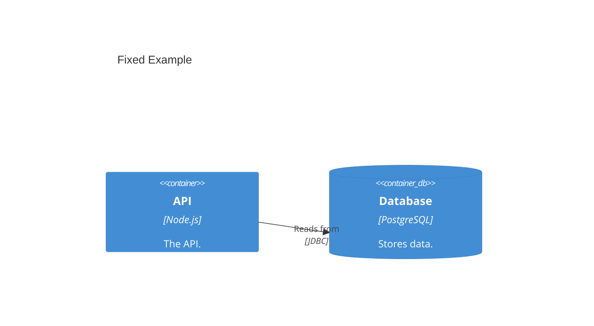
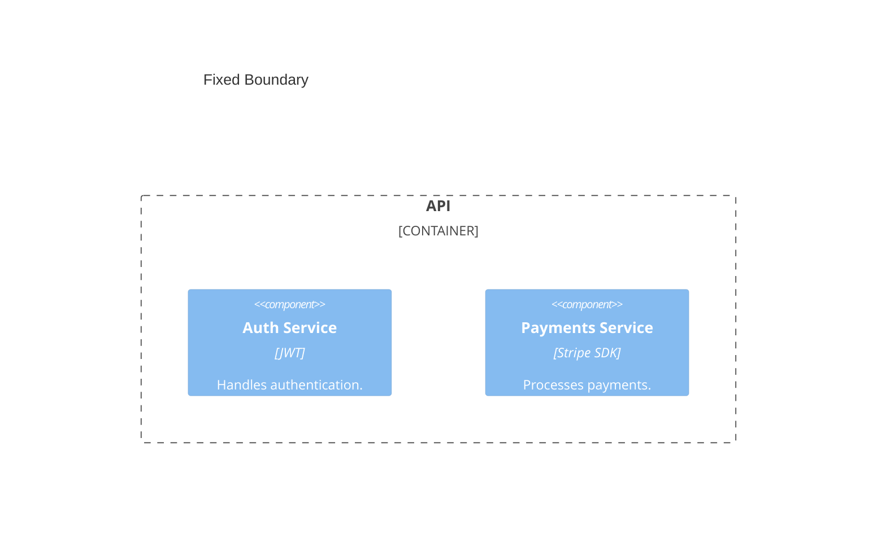

# Mermaid Errors

This page documents every known Mermaid C4 rendering error, its root cause, and the exact fix.

---

## ❌ `Cannot read properties of undefined (reading 'x')`

**Severity:** Critical — diagram will not render at all.

### Cause

You have a `Rel` statement that references an alias that was never defined in the diagram.

```mermaid
C4Container
    title Broken Example

    Container(api, "API", "Node.js", "The API.")
    Rel(api, db, "Reads from", "JDBC")
    <!--         ^^^ 'db' was never defined above! -->
```

### Fix

Define every alias you use in a `Rel` before the `Rel` statement:



### How to find it

Search your diagram for every alias used in `Rel(from, to, ...)` and verify that `from` and `to` both appear as the first parameter of a `Person`, `System`, `Container`, `Component`, or `Deployment_Node` statement.

---

## ❌ `Parse error on line N: ...Expecting 'NEWLINE', 'EOF', 'RBRACE', got 'LBRACE'`

**Severity:** Critical — diagram will not render at all.

### Cause

You (or your AI agent) appended `{` to a `System()` or `Container()` element to create a grouping. This is **invalid syntax**.

```mermaid
C4Container
    title Broken Boundary

    Container(api, "API", "Node.js", "The API.") {
        Component(auth, "Auth", "JWT")
    }
```

### Fix

Use `System_Boundary` or `Container_Boundary` for grouping:



### Boundary types

| Level | Correct boundary element |
|-------|------------------------|
| Context | `Enterprise_Boundary` |
| Container | `System_Boundary` |
| Component | `Container_Boundary` |

---

## ❌ `❌ Found Rel statement missing protocol parameter`

This error is raised by the **c4-skills validator**, not Mermaid itself. Your diagram will render but violates C4 notation rules.

### Cause

A `Rel` between two containers is missing the 4th (protocol) parameter:

```
Rel(spa, api, "Makes API calls to")
<!--                              ^ missing protocol -->
```

### Fix

Always specify the protocol as the 4th argument:

```
Rel(spa, api, "Makes API calls to", "JSON/HTTPS")
Rel(api, db, "Reads from and writes to", "JDBC")
Rel(api, queue, "Publishes events to", "AMQP")
```

---

## ❌ `❌ Found forbidden bare intent in Rel statement`

This error is raised by the **c4-skills validator**.

### Cause

Your `Rel` label is a generic verb: `"Uses"`, `"Calls"`, or `"Reads"`.

```
Rel(customer, banking, "Uses")
```

### Fix

Replace with a **descriptive intent** that explains *what* is being done:

```
Rel(customer, banking, "Views account balances and makes payments using", "HTTPS")
Rel(api, db, "Reads transaction history from", "JDBC")
Rel(api, email, "Sends payment confirmation notifications via", "SMTP")
```

---

## ❌ `❌ Found Container missing technology parameter`

### Cause

A `Container` is declared without its technology (3rd parameter):

```
Container(api, "API Application", "Provides banking functionality.")
<!--               no technology ^^ -->
```

### Fix

Always include the technology as the 3rd parameter and description as 4th:

```
Container(api, "API Application", "Node.js, Express", "Provides banking functionality via JSON/HTTPS API.")
```

---

## ⚠️ Diagram renders blank / empty

### Common causes

1. **Wrong graph type** — Used `graph LR` or `flowchart` instead of `C4Context`, `C4Container`, etc.
2. **Missing opening keyword** — The first line of a Mermaid C4 block must be the graph type.
3. **Incorrect fenced block** — The block must start with ` ```mermaid ` (three backticks).

### Fix

Ensure the mermaid block starts like this:

````
```mermaid
C4Container
    title My Diagram
    ...
```
````
