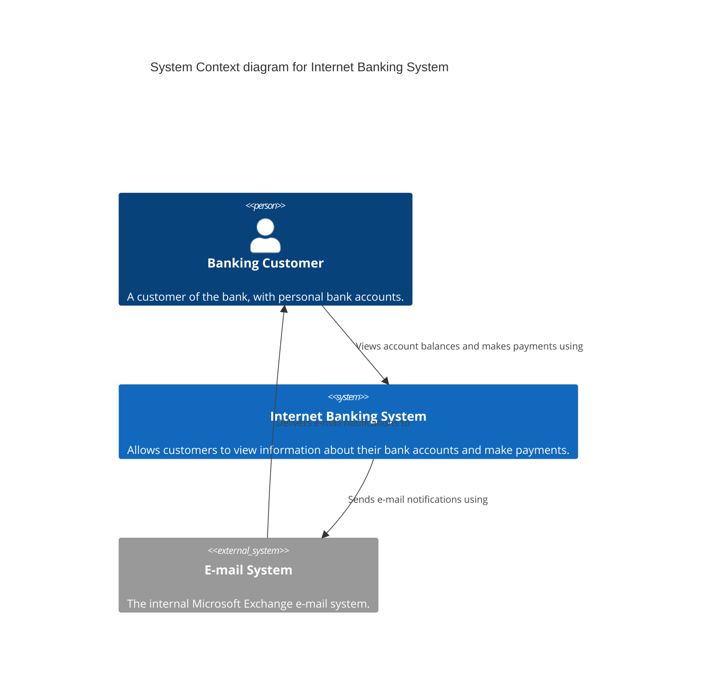

# Level 1 — System Context — Internet Banking System

## Overview

This diagram represents the Internet Banking System in its environment. It serves banking customers and integrates with an external Microsoft Exchange e-mail system.

## Diagram

## Legend

- **Person**: A human user interacting with the system.
- **System (in scope)**: The Internet Banking System itself.
- **System_Ext**: An external system outside our control.

## Elements

| Element | Type | Technology | Responsibility |
|---|---|---|---|
| Banking Customer | Person | — | Uses the system to manage money |
| Internet Banking System | System | — | Provides core internet banking functionality |
| E-mail System | System_Ext | Microsoft Exchange | Sends e-mail notifications |

## Key Relationships

| From | To | Intent | Protocol |
|---|---|---|---|
| Banking Customer | Internet Banking System | Views account balances and makes payments using | HTTPS |
| Internet Banking System | E-mail System | Sends e-mail notifications using | SMTP |
| E-mail System | Banking Customer | Delivers e-mail notifications to | SMTP/IMAP |

## Assumptions

- The customer interacts via a web or mobile browser.

## Links to other levels

- ↓ Level 2 — Container Diagram
