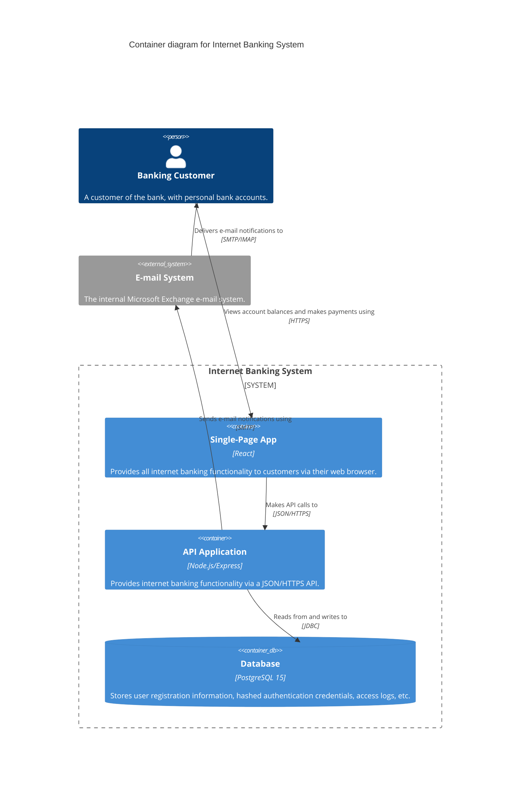

# Level 2 — Container — Internet Banking System

## Overview

This diagram was generated by scanning the `example-codebase` directory, including `docker-compose.yml`, `api/src/index.js`, and `frontend/src/App.jsx`.

## Diagram

## Legend

- **Person**: A human user.
- **Container**: A deployable unit (application, service, or data store).
- **System_Ext**: An external system outside our control.

## Elements

| Element | Type | Technology | Responsibility |
|---|---|---|---|
| Banking Customer | Person | — | Uses the system to manage money |
| Single-Page App | Container | React | Frontend UI |
| API Application | Container | Node.js/Express | Business logic and REST API |
| Database | ContainerDb | PostgreSQL 15 | Persistent data store |
| E-mail System | System_Ext | Microsoft Exchange | Sends e-mail notifications |

## Key Relationships

| From | To | Intent | Protocol |
|---|---|---|---|
| Banking Customer | Single-Page App | Views account balances and makes payments using | HTTPS |
| Single-Page App | API Application | Makes API calls to | JSON/HTTPS |
| API Application | Database | Reads from and writes to | JDBC |
| API Application | E-mail System | Sends e-mail notifications using | SMTP |

## Assumptions

- `docker-compose.yml` was used as the primary source of truth for container identification.
- The E-mail system endpoint was inferred from `api/src/index.js` SMTP comments.

## Links to other levels

- ↑ Level 1 — Context Diagram
