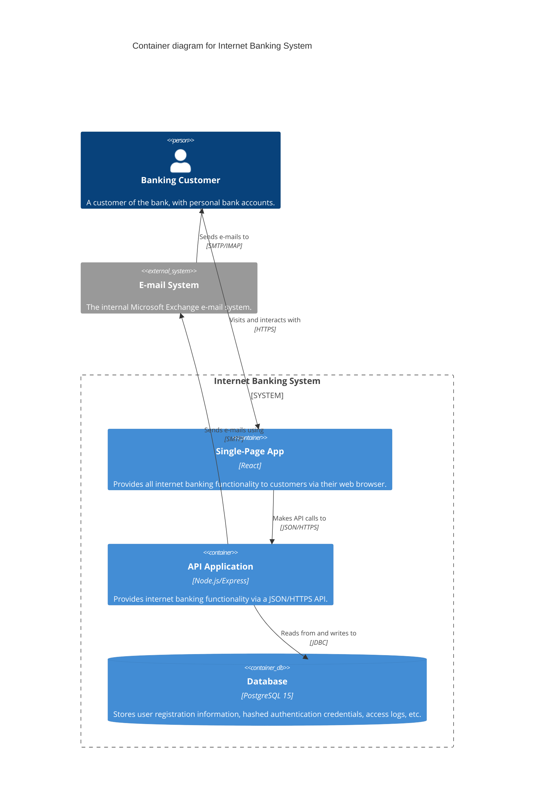

# Level 2 — Container — Internet Banking System

> **Diagram type**: Container
> **Scope**: The components inside the Internet Banking System.
> **Audience**: Software developers and operators.

## Overview

This diagram shows the high-level architecture of the Internet Banking System. It consists of a React Single-Page Application (SPA) serving as the frontend, a Node.js/Express REST API handling business logic, and a PostgreSQL database for persistent storage. It interacts with an external E-mail System.

## Diagram

## Legend

- **Person / actor**: human user of the system
- **System (in scope)**: the system the diagram is about
- **External system**: out-of-scope system our system interacts with
- **Container**: independently deployable application or data store

## Elements

| Element | Type | Technology | Responsibility |
|---|---|---|---|
| *Banking Customer* | *Person* | *—* | *A customer who uses the system to manage their money.* |
| *Single-Page App* | *Container* | *React* | *Provides all internet banking functionality to customers via their web browser.* |
| *API Application* | *Container* | *Node.js/Express* | *Provides internet banking functionality via a JSON/HTTPS API.* |
| *Database* | *ContainerDb* | *PostgreSQL 15* | *Stores user registration information, hashed authentication credentials, access logs, etc.* |
| *E-mail System* | *System_Ext* | *Microsoft Exchange* | *Sends emails to customers.* |

## Key relationships

| From | To | Intent | Protocol / Technology |
|---|---|---|---|
| *Banking Customer* | *Single-Page App* | *Visits and interacts with* | *HTTPS* |
| *Single-Page App* | *API Application* | *Makes API calls to* | *JSON/HTTPS* |
| *API Application* | *Database* | *Reads from and writes to* | *JDBC* |
| *API Application* | *E-mail System* | *Sends e-mails using* | *SMTP* |

## Notable architectural decisions

- **PostgreSQL Database**: Chosen over MongoDB to ensure strict ACID compliance for financial transactions.
- **Single Page Application**: Chosen to provide a rich, responsive user experience decoupled from backend deployments.

## Links to other levels

- *↑ [Level 1 - Context Diagram](./context.md) — more abstract view*
