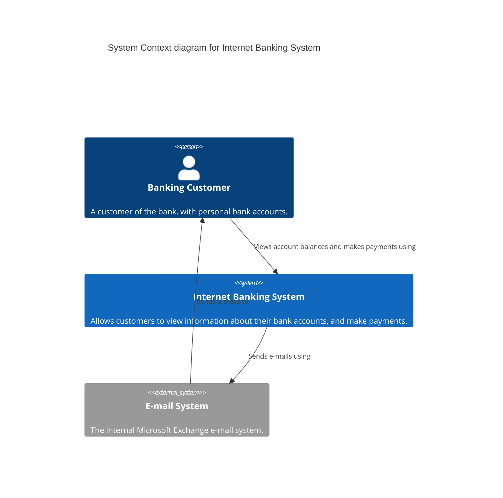

# Level 1 — System Context — Internet Banking System

> **Diagram type**: System Context
> **Scope**: The overall Internet Banking System and its external interactions.
> **Audience**: Product owners, stakeholders, and high-level architects.

## Overview

This diagram shows the Internet Banking System in its environment. It serves banking customers by allowing them to view account balances and make transactions. To notify customers, it relies on an external Microsoft Exchange E-mail System.

## Diagram

## Legend

- **Person / actor**: human user of the system
- **System (in scope)**: the system the diagram is about
- **External system**: out-of-scope system our system interacts with

## Elements

| Element | Type | Technology | Responsibility |
|---|---|---|---|
| *Banking Customer* | *Person* | *—* | *A customer who uses the system to manage their money.* |
| *Internet Banking System* | *System* | *—* | *Provides the core internet banking functionality.* |
| *E-mail System* | *System_Ext* | *Microsoft Exchange* | *Sends emails to customers.* |

## Key relationships

| From | To | Intent | Protocol / Technology |
|---|---|---|---|
| *Banking Customer* | *Internet Banking System* | *Views account balances and makes payments using* | *HTTPS* |
| *Internet Banking System* | *E-mail System* | *Sends e-mails using* | *SMTP* |
| *E-mail System* | *Banking Customer* | *Sends e-mails to* | *SMTP/IMAP* |

## Notable architectural decisions

- An external e-mail system is used to offload delivery guarantees and comply with enterprise communication standards.

## Assumptions

- We assume the customer interacts directly with the Banking System via a web interface.

## Links to other levels

- *↓ [Level 2 - Container Diagram](./container.md) — zoom on the Internet Banking System*
